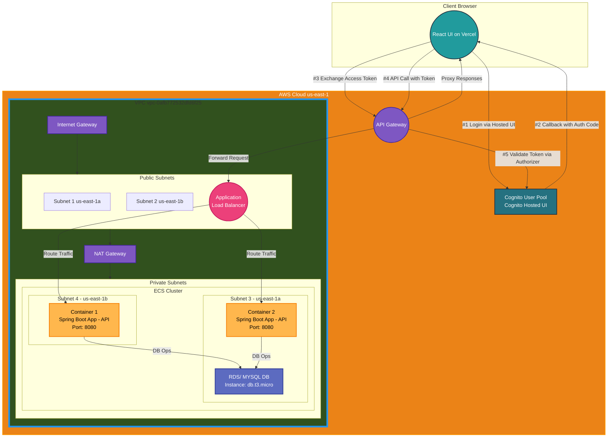

# To-do app

## Application architecture diagram

```mermaid
graph TB
    %% Style definitions
    classDef aws fill:#EB8317,stroke:#FF9900,color:white,stroke-width:2px
    classDef vpc fill:#31511E,stroke:#2196F3,stroke-width:5px
    classDef subnet fill:#BBDEFB,stroke:#1976D2,stroke-width:2px
    classDef rds fill:#5C6BC0,stroke:#283593,color:white,stroke-width:2px
    classDef container fill:#FFB74D,stroke:#F57C00,color:black,stroke-width:2px
    classDef alb fill:#EC407A,stroke:#C2185B,color:white,stroke-width:2px
    classDef gateway fill:#7E57C2,stroke:#4527A0,color:white,stroke-width:2px
    classDef cognito fill:#257180,stroke:#232F3E,color:white,stroke-width:2px
    classDef ui fill:#219B9D,stroke:#232F3E,color:white,stroke-width:2px

    subgraph CLIENT[Client Browser]
        REACTUI((React UI on Vercel))
    end

    subgraph AWS[AWS Cloud us-east-1]
        APIGW((API Gateway))
        COGNITO[Cognito User Pool <br> Cognito Hosted UI]
        
        subgraph VPC[VPC vpc-0afb772532dfd6f25]
            subgraph PUBLIC[Public Subnets]
                PS1[Subnet 1 us-east-1a]
                PS2[Subnet 2 us-east-1b]
                ALB((Application <br>Load Balancer))
            end
            subgraph PRIVATE[Private Subnets]
                subgraph ECS[ECS Cluster]
                    subgraph PRS2[Subnet 3 - us-east-1a]
                        DB[RDS/ MYSQL DB<br/>Instance: db.t3.micro]
                        TASK2[Container 2<br/>Spring Boot App - API <br/> Port: 8080]
                    end      
                    subgraph PRS1[Subnet 4 - us-east-1b]
                        TASK1[Container 1<br/>Spring Boot App - API <br/> Port: 8080]
                    end   
                end
            end
            IGW[Internet Gateway]
            NAT[NAT Gateway]
        end
    end

    %% Authentication Flow
    REACTUI -->|#1 Login via Hosted UI| COGNITO
    COGNITO -->|#2 Callback with Auth Code| REACTUI
    REACTUI -->|#3 Exchange Access Token| APIGW
    REACTUI -->|#4 API Call with Token| APIGW
    APIGW -->|#5 Validate Token via Authorizer| COGNITO
    
    %% Application Flow
    APIGW -->|Proxy Responses| REACTUI
    APIGW -->|Forward Request| ALB
    ALB -->|Route Traffic| TASK1
    ALB -->|Route Traffic| TASK2
    TASK1 -->|DB Ops| DB
    TASK2 -->|DB Ops| DB
    
    %% Network Flow
    IGW --> PUBLIC
    NAT --> PRIVATE
    PUBLIC --> NAT

    %% Apply styles
    class AWS aws
    class REACTUI ui
    class COGNITO cognito
    class APIGW gateway
    class VPC vpc
    class ALB alb
    class TASK1,TASK2 container
    class DB rds
    class IGW,NAT gateway
```