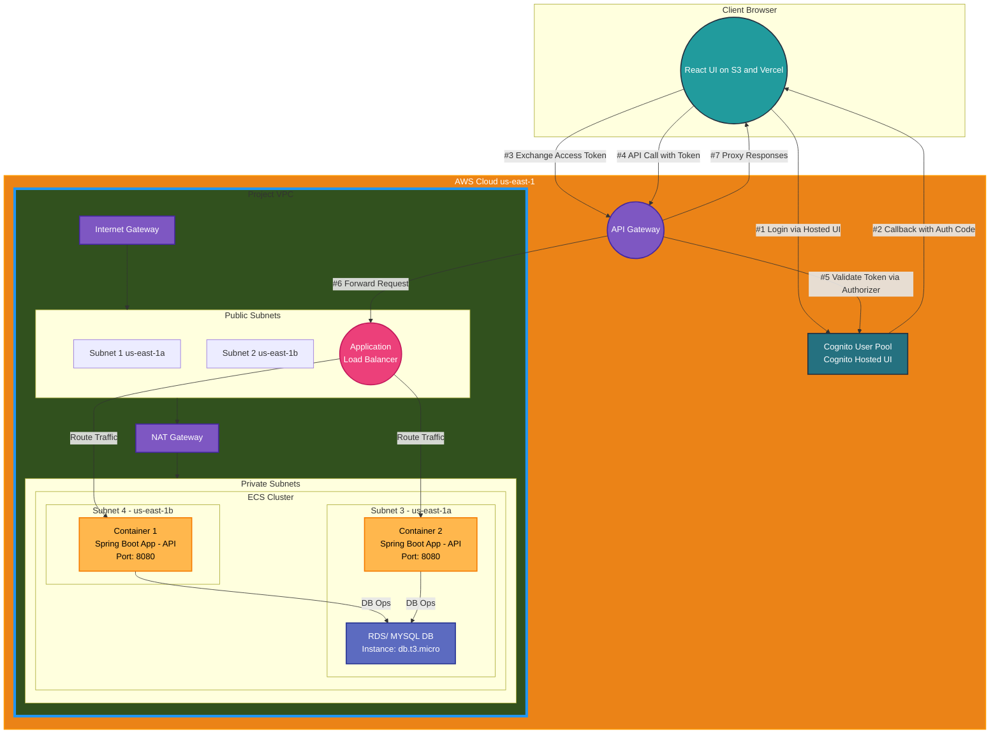

# To-do List Application
- This project is aimed to implement a to-do list application utilizing AWS cloud services and employing agile development practices. 
- The resulting web application enables users to authenticate through AWS Cognito and manage their personal to-do’s through an user-friendly UI. 
- The application allows users to create to-do’s with titles, descriptions, images, categories, priorities, set deadlines and completion status. Users can update or delete specific to-do item, and on the to-do’s dashboard, can view all to-do’s in an organized way, apply filters and sort their to-do’s based on criterias including creation date, deadline, category, priority and completion status.

## Sprints Overview
The project is completed in two sprints focusing on different aspects of the application:
### Sprint 1: Infrastructure Setup and Authentication:
 This sprint focused on setting up the cloud infrastructure using AWS services and implementing user authentication using AWS Cognito.
### Sprint 2: Core To-Do Management Features:
 The second sprint focused on developing the core functionality of the to-do list application, including CRUD operations for to-do items and frontend-backend integration.
## Epics and User Stories
The project was divided into three main epics:
### Epic: Application Design
- TODOAPP-1: Create application architecture diagram
- TODOAPP-15: Backend application deployment and configuration on cloud
- TODOAPP-16: CI/CD and IAC script generation using Terraform
### Epic: IDP Login
- TODOAPP-4: Allow users to authenticate via AWS Cognito (IDP Login)
### Epic: Application Functions Development
- TODOAPP-7: Allow users to add new to-do items and the details including title, description, priority, and an image
- TODOAPP-9: Allow users to view their to-do items in an organized way enabling them to filter, sort, and group them
- TODOAPP-8: Allow users to change details of to-do items such as title, description, status, deadline, and priority

## Definition of Ready  and Definition of Done 
To ensure that stories were well-defined before work began and properly completed once development was finished, stated standards for Definition of Ready (DoR) and Definition of Done (DoD) as below:

### Definition of Ready (DoR):
- Explicit Title: Each task had a clear, concise title that described the task or feature.
- Clear Description: Each task included a user story written in the format: "As a ..., I want to ..., so that...".
- Story Points Estimation: Each task was estimated using story points to indicate complexity and effort.
- No Blockers: Tasks were only marked as ready if there were no blockers preventing them from being started.

### Definition of Done (DoD):
- Implemented: The feature was fully developed and integrated into the application.
- Documented: The feature was documented, ensuring clarity and ease of understanding.
- Passes CI and Build: The feature passed all CI pipeline checks and build steps.

## CI / CD
The project utilizes an automated CI/CD pipeline using GitHub Actions, DockerHub, and Terraform. The pipeline has two parts, first, build and deploy image whenever changes were pushed to the master branch, second, use the latest docker image on Task Definiton part of the Terraform script and integrate other infrastructure elements.
### GitHub Actions: 
The pipeline was triggered on code pushes to the master branch. The GitHub Actions workflow was responsible for:
- Checking out the latest code.
- Building the Spring Boot application using Maven with tests.
- Building a Docker image of the application.
- Pushing the Docker image to DockerHub.
### DockerHub: 
The Docker image generated by the GitHub Actions pipeline was stored in a public DockerHub repository, from where it could be pulled by AWS ECS during deployment.
### Terraform: 
Terraform is used to define and provision the AWS infrastructure. It managed the creation of the VPC, subnets, route tables, gateways, security groups, ECS cluster, RDS MySQL instance, Cognito client, ELB and API Gateway. When creating containers, Terraform uses the latest image that is pushed via Github Actions to DockerHub.

## Application Architecture

### Diagram

### API Endpoints
The  backend application exposes API endpoints to manage to-do items and exchange authorization code with access tokens via AWS Cognito. These endpoints allow users to create, retrieve, update, and delete their to-do items and obtain access tokens. A swagger UI and OpenAPI specification is also generated for APIs which are available on the paths of /swagger-ui.html and /v3/api-docs of backend application.

#### API Request and Response Structure:
- Authorization: All API requests require authorization header (Bearer <access_token>).
Only exception is /api/v1/auth/token endpoint which used to obtain access token with the authorization code. 
- Request and Response Format: All API requests and responses are in JSON format.
- CORS: The API Gateway is configured with CORS (Cross-Origin Resource Sharing), allowing the frontend app to securely communicate with the backend.

#### Endpoint Details:
- POST /api/v1/auth/token
    - Description: Exchanges an authorization code for an access token and refresh token via Cognito.
    - Request Body Fields: code, redirectUri (the URL to which the user is redirected after authentication).
    - Example:
    {
    "code": "AUTHORIZATION_CODE",
    "redirectUri": "https://ww.com/callback"
    }
    - Response: The access token and refresh token are returned in JSON format.
- GET /api/v1/todo
    - Description: Retrieves all to-do items for the authenticated user.
    - Response: A list of all to-do items for the user is returned in JSON format.
-POST /api/v1/todo
    - Description: Creates a new to-do item for the authenticated user.
    - Request Body Fields: title, description, priority, status, category, deadline.
    - Example:
    {
    "title": "Complete documentation",
    "description": "Finish writing project documentation",
    "priority": "high",
    "status": "TO_DO",
    "category": "Work",
    "deadline": "2023-12-31T23:59:59"
    }
    - Response: The newly created to-do item’ ID returned in JSON format.
- GET /api/v1/todo/{id}
    - Description: Retrieves a specific to-do item by its ID.
    - Path Parameter: id: The unique identifier of the to-do item to be retrieved.
    - Response: The details of the specified to-do item are returned in JSON format.
- PATCH /api/v1/todo/{id}
    - Description: Updates a specific to-do item by its ID.
    - Path Parameter: id: The unique identifier of the to-do item to be updated.
    - Request Body Fields: title, description, priority, status, category, deadline.
    - Example:
    {
    "title": "Update documentation",
    "description": "Add more details to the project documentation",
    "priority": "medium",
    "status": "IN_PROGRESS",
    "deadline": "2023-12-30T23:59:59"
    }
    - Response:  The updated to-do item is returned in JSON format.
- DELETE /api/v1/todo/{id}
    - Description: Deletes a specific to-do item by its ID.
    - Path Parameter: id: The unique identifier of the to-do item to be deleted.
    - Response: A confirmation message that the to-do item was successfully deleted or error details.
